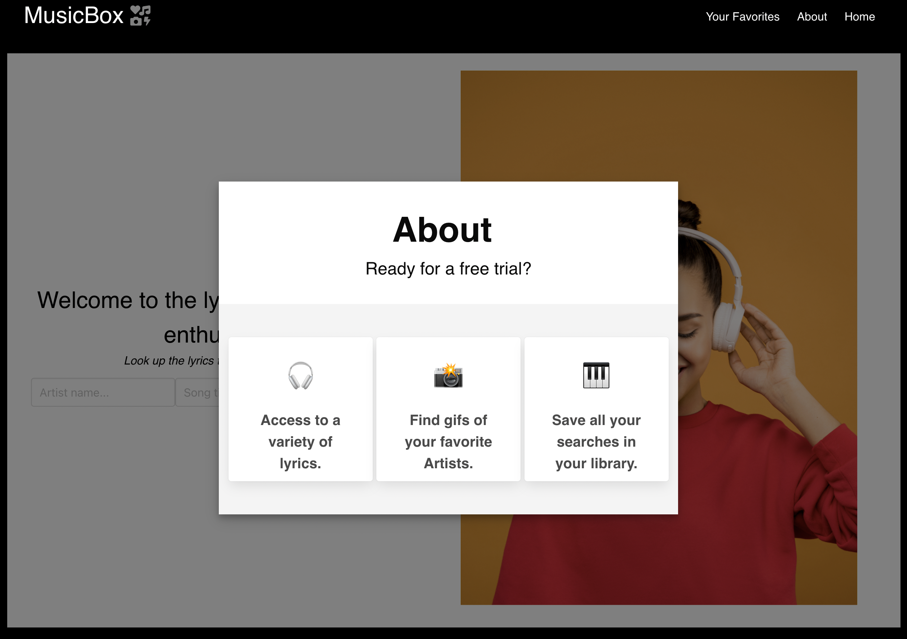

# Music-Box

## Description
MusicBox is an easy to use tool that allows the user to search the lyrics of their favorite songs by inputting the artist name and song title. Their lyric searches can be saved to a personal library. The user will also be presented with a gif associated with the search.

## User Story
* AS a music enthusiast 
* I WANT to have the option to search for a variety of songs and learn their lyrics
* SO THAT I can sing along

## Acceptance Criteria 
* GIVEN a lyric library with form inouts
* WHEN I search for an artist's song lyrics
* THEN I am presented with the Song title and lyrics
* WHEN I am presented with the lyrics associated with the search
* THEN I am presented with a gif to the right of the page related to the search
* WHEN I view "Your Favoites" tab
* THEN I am presented with my recent song searches
* WHEN I click on "Home"
* THEN I am presented with the homepage
* WHEN I view the "About" tab
* THEN I am presented with about content inside a modal

<a href="https://chloeyarb.github.io/Music-Box/">MusicBox Link</a>

## Contributors

* Nicole Barranca
* Chloe Yarborough
* Haejeong Kim 

## Presentation 
